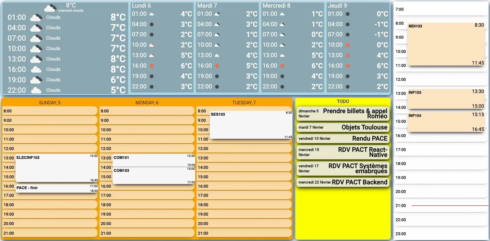
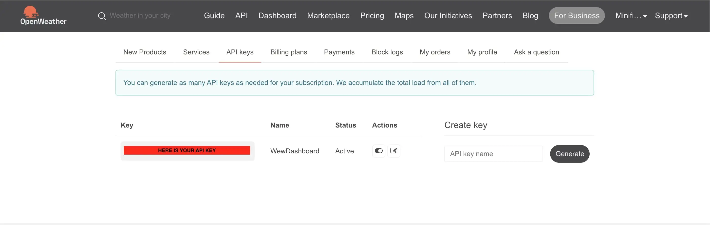
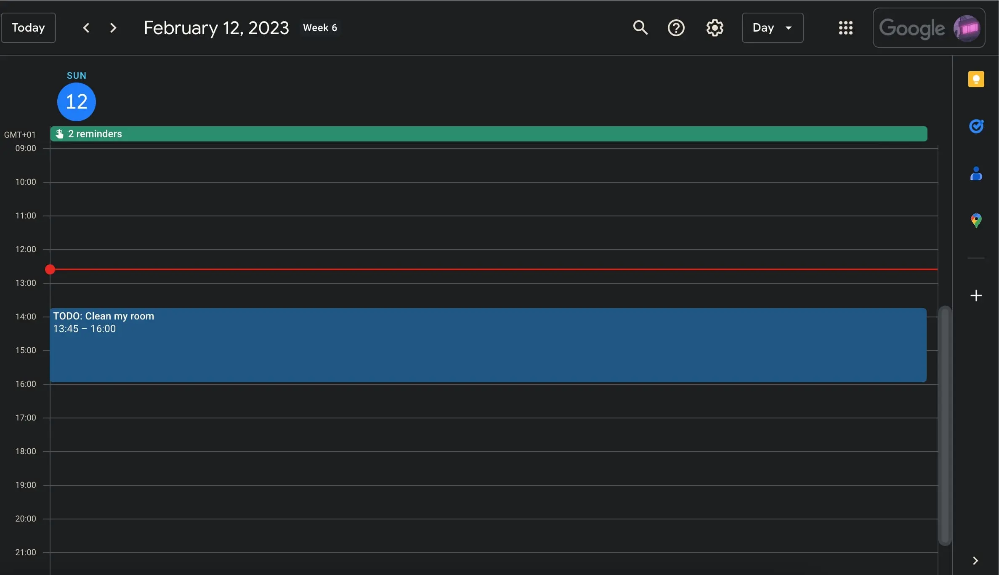
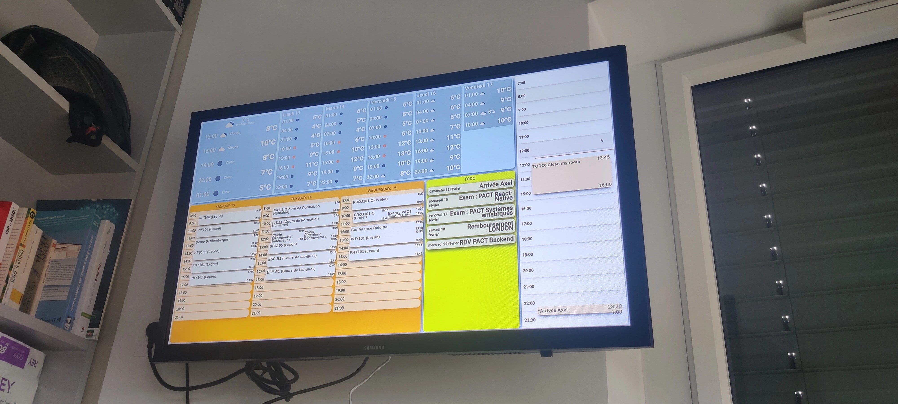

# A personal dashboard for Raspberry Pi

## A quick preview ?



You can display your agendas, the meteo and your TODO tasks. Then, up to you to add anything else!

<br>


## How to setup ?

The ready-to-use app is in the `/out` directory.

### 1. Meteo setup
In order to access meteo data, you need to use a Weather API. The dashbaord is configured to deal with the OpenWeather's one. Follow this steps to setup your own meteo access :

1. Go to [OpenWeather](https://openweathermap.org/) and create an API key ([see this](https://openweathermap.org/appid))

You should get it here :
 

2. Create a file called `meteo_config.json` in `/out/app/assets/config/` and add the following content :
```json
{
    "openWeatherMapApiKey": "YOUR API KEY",
    "myLon": 23.71701,
    "myLat": 2.223130
}
```
where `myLon` and `myLat` propreties are the longitude and latitude of the place where you want to get weather informations. You can use [this tool](https://www.latlong.net/) to find your own.

<br>

### 2. Calendars setup
Most of the caledar are stored as [iCalendar](https://en.wikipedia.org/wiki/ICalendar) format. You can easily find a way to get your favorites calendars in this very format. In most calendars app, you can do it using sharing tools. For instance, for Google Calendar see : [this link](https://support.google.com/calendar/answer/37648?hl=en#:~:text=On%20your%20computer%2C%20open%20Google%20Calendar.&text=Settings.,Click%20Integrate%20calendar.).
You should get a link to an `.ics` or `.ical` file.

For every calendar you wish to add to your dashboard, get this `.ics` or `.ical` file and add a file called `cal-YOUR_AGENDA_NAME` to `/out/backend/config/` where `YOUR_AGENDA_NAME` isn't significant, it is up to you to choose. In this file, add the following content :
```json
{
    "name": "YOUR AGENDA NAME",
    "icalUrl": "your calendar ics or ical file link"
}
```
where the `name` proprety isn't relevant and only use for debug (you can choose a different name than the one used for the file name) and `icalUrl` is the link to your `.ics` or `.ical` file.

<br>

### 3. Tasks calendar setup
You can see on the dashboard, there is a **TASK** panel. It is used to retreive certain events marked as important from the calendars registered previously to prompt them on the dashboard.

How to identify those events ? In order for the app to find those important events in your calendars, you need to add a __Task word identifier__ at the begining of an event title. 

For instance if you choose *TODO:* as your identifier, for an event you want to add to the **TASK** panel, you should name it *TODO: Clean my room*.

Example : 

Then the app will retreive all the events with this identifier in your agendas to prompt them on the **TASK** panel.

To choose your own __Task word identifier__ edit the `/out/backend/config/agendas-config.json` file and the `tasks_word` proprety.

Example: 
```json
{
    "tasks_word": "TODO:"
}
```

<br>

### 4. Instal dependencies

Go to `/out` and run `npm install` to add dependencies.

<br>

## How to run for production ?
Now you have your app ready to use. 
You can start it by running `npm run start` in `/out`.
The dashboard should be running at `localhost:3000`.

If you want to start it in the background you can use [pm2](https://pm2.keymetrics.io/). Install it globally and then run `pm2 start npm --name "WewDashboard" -- start` in `/out`.

<br>




## Customize it
### The frontend app
The app is made using Angular. You can find it in `/WewDashboardWeb`.
You should add the config files mentionned previously and then you can edit the Angular app as you wish.

You can then build it using `ng build` and copy the outputs to `/out` using `npm start postbuild` (make sure to install [copyfiles](https://www.npmjs.com/package/copyfiles) globally before).

### The backend app
The backend is made using nodeJS and express. You can as well edit it and use the same `npm start postbuild` to copy outputs to `/out`. I used the TypeScript to develop the nodeJS app as well as live-reloading processes.


<br>

## Troubleshooting
At first, I made this app for my own personal use so many things may differ from your own use. If you have any issues, make sure to details them in the issues section, I'll be happy to work with you on it to make the dashbaord progress.


